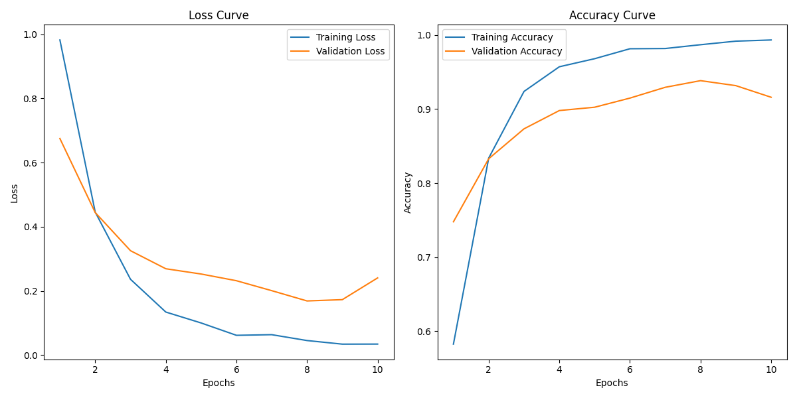
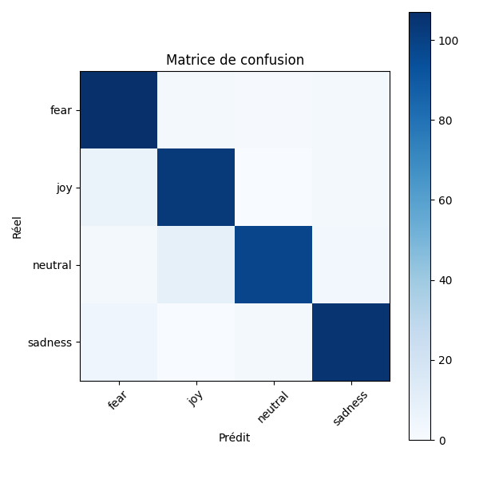

# 🧠 Emotion Recognition from EEG Radar Spectrograms

Ce projet implémente un système de **reconnaissance des émotions** basé sur des **spectrogrammes générés à partir de signaux EEG**, en utilisant un modèle de deep learning de type **ResNet18**.

## 🎯 Objectif

Développer un algorithme de classification d’émotions (joie, peur, tristesse, neutre) à partir d’images générées depuis des signaux EEG radar, dans le cadre du module de **Reconnaissance Émotionnelle**.

---

## 📁 Structure du projet

| Chemin                        | Description                                             |
|------------------------------|---------------------------------------------------------|
| `eeg_raw_data/`              | Données EEG brutes (fichiers `.mat`)                   |
| `graph/`              | Matrice de confusion et courbe d'apprentissage                   |
| `model/`              | Modèle enregistré                  |
| `main_emotion_recognition.py`| Script principal du projet                              |
| `requirements.txt`           | Fichier listant les dépendances Python                 |
| `README.md`                  | Fichier de documentation du projet                     |

---

## 🔧 Étapes du pipeline

1. **Prétraitement des données EEG**  
   - Extraction des signaux depuis les fichiers `.mat`
   - Génération des **spectrogrammes** (transformée temps-fréquence)
   - Attribution des étiquettes d’émotion
   - Sauvegarde des images en `.png`

2. **Split des données**  
   - Répartition en ensembles `train`, `val`, `test` (70% / 20% / 10%)

3. **Classification via CNN (ResNet18)**  
   - Chargement et normalisation des images
   - Fine-tuning de `ResNet18` pré-entraîné sur ImageNet
   - Entraînement sur les spectrogrammes radar
   - Évaluation : Accuracy, F1-score, Matrice de confusion

4. **Visualisations**
   - Tracé des courbes d’apprentissage : `loss` et `accuracy`
   - Matrice de confusion finale

---

## 📊 Résultats obtenus

| Classe     | Précision | Rappel | F1-score |
|------------|-----------|--------|----------|
| Peur       | 0.88      | 0.96   | 0.92     |
| Joie       | 0.90      | 0.92   | 0.91     |
| Neutre     | 0.97      | 0.88   | 0.92     |
| Tristesse  | 0.94      | 0.94   | 0.94     |
| **Accuracy globale** | **0.92** |        |          |

---

### 📈 Courbes d'apprentissage



- **Loss Curve (à gauche)** : montre la baisse de l’erreur lors de l’entraînement.
  - La perte d'entraînement diminue fortement, suggérant une bonne capacité d'apprentissage.
  - La perte de validation suit une tendance similaire, indiquant une bonne généralisation jusqu’à la 9ᵉ époque.

- **Accuracy Curve (à droite)** : montre la précision croissante du modèle.
  - La précision d'entraînement atteint presque 100 %.
  - La précision de validation plafonne autour de 92–94 %, ce qui est excellent et témoigne d’un bon équilibre.

---

### Matrice de confusion



- Chaque ligne représente la **vérité terrain**, chaque colonne les **prédictions du modèle**.
- La forte diagonale montre que le modèle classe bien chaque émotion.
- Les quelques erreurs se répartissent modérément entre émotions voisines.

---

## 💻 Exécution du projet

### 1. Installer les dépendances

```bash
pip install -r requirements.txt
```

### 2. Lancer le script principal

```bash
python main_emotion_recognition.py
```

## 📦 Données

Les données EEG sont issues du dataset **SEED-IV** disponible publiquement sur Kaggle.

🔗 Lien : [SEED-IV Emotion EEG Dataset on Kaggle](https://www.kaggle.com/datasets/phhasian0710/seed-iv?resource=download)

Chaque session contient 24 essais EEG associés à une émotion (joy, sadness, fear, neutral).

### 📥 Installation des données (manuel)

1. Téléchargez les fichiers `.mat` du dataset SEED-IV depuis Kaggle via le lien ci-dessus.
2. Créez un dossier `eeg_raw_data/` à la racine du projet (s'il n'existe pas).
3. Placez les fichiers `.mat` téléchargés dans ce dossier :

```bash
mkdir eeg_raw_data
```

Puis placez les fichiers .mat ici manuellement.

⚠️ Les fichiers .mat sont volumineux : ils ne sont pas inclus dans le dépôt Git pour éviter les limitations de bande passante (LFS).


## 🧠 Modèle utilisé

* 📚 **ResNet18** (modèle convolutif résiduel).

* 🔁 **Transfer learning :** fine-tuning de la couche fully connected.

Choisi pour sa profondeur raisonnable et ses performances éprouvées sur des tâches d’image.

## 📝 Auteurs

Arthur JAFFRE

Projet de Reconnaissance Émotionnelle – École Hexagone
